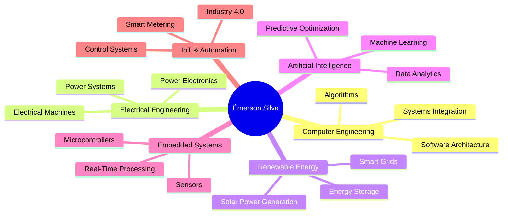
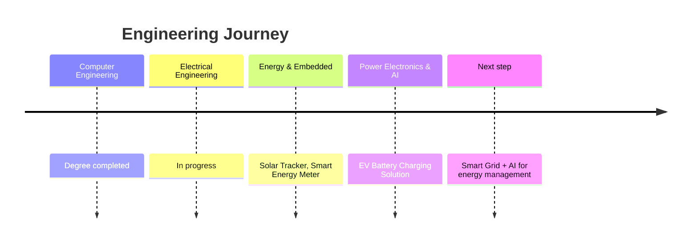

<div align="center">


<br>

<a href="https://www.linkedin.com/in/emersonsilvaarau"></a>
<a href="https://github.com/emersonsilvaar"></a>


</div>

<br>

```bash
emerson@engineering:~$ whoami
> Computer Engineer, graduated. Electrical Engineering, in progress.

emerson@engineering:~$ cat mission.txt
> Fuse computer engineering, embedded systems, power electronics
> and AI into intelligent solutions for energy and industry.

emerson@engineering:~$ ls current_focus/
> embedded-systems/  iot/  power-electronics/  renewable-energy/  smart-grids/
```

<br>

## 🧬 How the pieces fit together



<br>

## 🛠️ Stack

<table align="center">
<tr><td valign="top" width="33%">

**Languages**


</td><td valign="top" width="33%">

**Tools & Frameworks**


</td><td valign="top" width="33%">

**Hardware & Cloud**


</td></tr>
</table>

<div align="center">

**Engineering**
&nbsp;


</div>

<br>

## 📡 Proficiency Radar

| Area | Level |
|:--|:--|
| 💻 Software / Algorithms | `█████████████████` 100% |
| ⚡ Power Systems / Electrical | `████████████████` 100% |
| 📡 Embedded Systems / IoT | `████████████████░` 90% |
| ☀️ Renewable Energy / Smart Grids | `███████████████` 100% |
| 🧠 AI / Data Analytics | `███████████████` 100% |
| 🔋 Power Electronics / Batteries | `█████████████████` 100% |

<br>

## 🚀 Projects

<table align="center" width="100%">
<tr>
<th>Project</th><th>Domain</th><th>Stack</th><th>Status</th>
</tr>
<tr>
<td><b>☀️ Dual-Axis Solar Power Tracker</b></td>
<td>Renewable Energy · Embedded</td>
<td><code>Sensors/LDRs</code> <code>Stepper Motors</code> <code>C/C++</code> <code>AI</code></td>
<td>🟢 Active</td>
</tr>
<tr>
<td><b>🔋 EV Battery Charging Solution</b></td>
<td>Power Electronics · Energy</td>
<td><code>Battery Systems</code> <code>Converters</code> <code>Embedded</code> <code>AI</code></td>
<td>🟢 Active</td>
</tr>
<tr>
<td><b>⚡ Smart Energy Meter</b></td>
<td>IoT · Data Analytics</td>
<td><code>Embedded Systems</code> <code>IoT</code> <code>Python</code> <code>Dashboards</code></td>
<td>🟢 Active</td>
</tr>
<tr>
<td><b>📚 Electrical Engineering Knowledge Portal</b></td>
<td>EdTech · Web</td>
<td><code>Smart Grids</code> <code>Web Dev</code> <code>Cloud</code> <code>AI</code></td>
<td>🟡 Evolving</td>
</tr>
</table>

<details>
<summary align="center"><b>📖 View project details</b></summary>
<br>

**☀️ Dual-Axis Solar Power Tracker System**
An automated dual-axis solar tracking system that adjusts panel position throughout the day to maximize sunlight exposure and energy harvesting efficiency, combining embedded systems, sensors, motor control, and intelligent optimization. Future perspective: weather forecasting, IoT monitoring, AI-based optimization, and smart grid connectivity.

**🔋 Electric Vehicle Battery Charging Solution**
An intelligent EV charging platform designed to manage charging processes, optimize energy consumption, and protect modern battery systems, integrating power electronics, embedded technologies, and AI. Future perspective: battery management systems (BMS), renewable energy integration, cloud monitoring, and vehicle-to-grid (V2G) technologies.

**⚡ Smart Energy Meter**
A smart energy meter that measures electrical variables in real time and turns them into actionable information for monitoring, analysis, and decision-making, integrating embedded systems, IoT, data analytics, and AI. Future perspective: waste detection, consumption insights, and predictive analysis for residential, commercial, and industrial environments.

**📚 Electrical Engineering Knowledge Portal**
A comprehensive Electrical Engineering portal centralizing technical knowledge, tools, and resources across power systems, renewable energy, electrical machines, industrial automation, smart grids, and AI. Future perspective: engineering calculators, a technical standards library, interactive simulations, AI-powered assistants, and professional communities.

</details>

<br>

## 📊 Metrics

<div align="center">

<picture>
  <source media="(prefers-color-scheme: dark)" srcset="https://github-readme-stats.vercel.app/api?username=engenheiroemerson&show_icons=true&theme=tokyonight&hide_border=true&count_private=true"/>
  <source media="(prefers-color-scheme: light)" srcset="https://github-readme-stats.vercel.app/api?username=engenheiroemerson&show_icons=true&theme=default&hide_border=true&count_private=true"/>
  
</picture>
<picture>
  <source media="(prefers-color-scheme: dark)" srcset="https://github-readme-streak-stats.herokuapp.com/?user=engenheiroemerson&theme=tokyonight&hide_border=true"/>
  <source media="(prefers-color-scheme: light)" srcset="https://github-readme-streak-stats.herokuapp.com/?user=engenheiroemerson&theme=default&hide_border=true"/>
  
</picture>

<br><br>


<br><br>


<br>


<!--
  Optional 3D contribution graph:
  Once the Action below runs on your repository and generates the SVGs
  in the profile-3d-contrib/ folder, uncomment the line below:

  
-->

</div>

<br>

## 🗺️ Roadmap



<br>

## 🎓 Education & Languages

<table align="center">
<tr><td valign="top">

| Course | Status |
|:--|:--:|
| Computer Engineering | ✅ |
| Electrical Engineering | 🔄 |

</td><td valign="top">

| Language | Level |
|:--|:--:|
| 🇧🇷 Portuguese | Native |
| 🇺🇸 English | Professional |

</td></tr>
</table>

<br>

<div align="center">

> *"Engineering is about turning ideas into innovative, intelligent, and sustainable solutions that create a positive impact on society."*

<br>

<a href="https://www.linkedin.com/in/emersonsilvaarau"></a>


</div>

<br>
